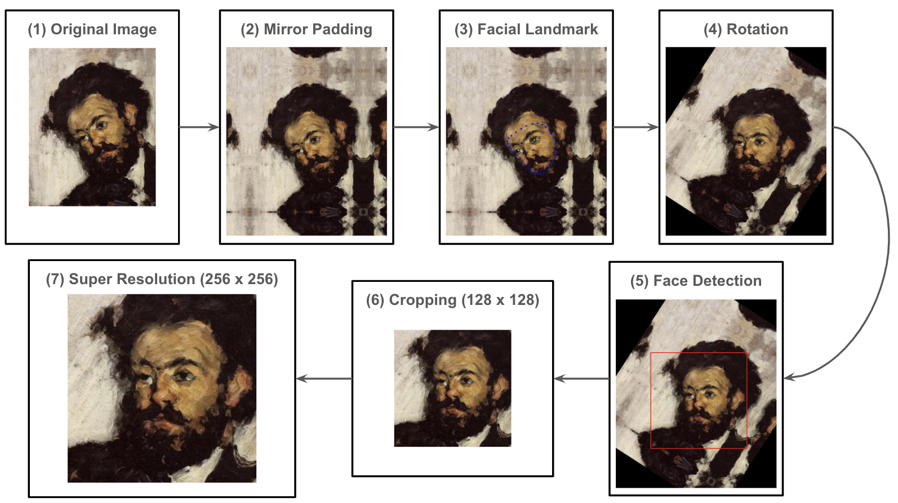
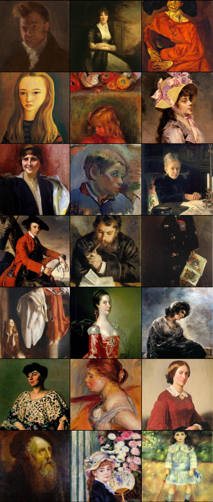
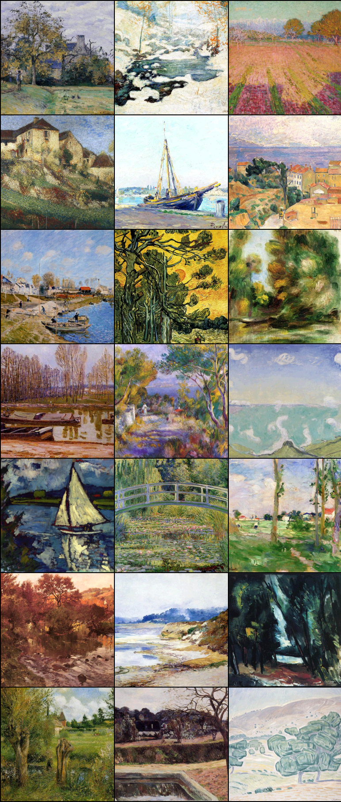
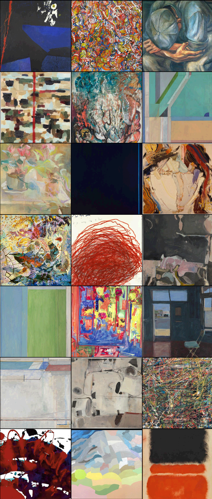

# WikiART Face/WikiART General Imageset & WikiART Crawler

<p align="center">
<br>
<em>Figure 1: Samples from WikiART Face dataset.</em>
</p>

This is an official repository of [***WikiART Crawler***](#wikiart-crawler), a python-library to download/process images from [WikiART](https://www.wikiart.org/) via WikiART API,
and two following image datasets created with the WikiART Crawler.

- [***WikiART Face***](#wikiart-face): Image dataset of face produced from the portraits attained via WikiART Crawler. 
- [***WikiART General***](#wikiart-general): Image dataset of paintings (landscape and portrait) attained via WikiART Crawler.

To use the datasets, one can use it via [WikiART Crawler](#wikiart-crawler) that allows fine-grained controll of the dataset. 
Or check [dataset links section](#dataset-links) to directly download the zip files. 

### WikiART Face

<p align="center">
<br>
<em>Figure 2: Pipeline to produce single WikiART Face image.</em>
</p>

WikiART Face is a collection of face from paintings. Inspired by the largest human-face image set [CelebA](https://mmlab.ie.cuhk.edu.hk/projects/CelebA.html),
we process all the portraits from WikiART with the pipeline described in Figure 2. 
As the final step, we blur the corner of each image so that model can pay more attention on the face rather than the background.
We release both version of the dataset w/wo the final blur step.
Below table shows the image size per each art movement.

|  Art Movement              |   WikiART Face |
|:---------------------------|---------------:|
| abstract-expressionism     |             22 |
| baroque                    |             17 |
| ecole-de-paris             |            228 |
| expressionism              |            649 |
| impressionism              |          1,166 |
| naive-art-primitivism      |             72 |
| neo-impressionism          |             41 |
| neoclassicism              |            607 |
| post-impressionism         |            474 |
| pre-raphaelite-brotherhood |            103 |
| realism                    |          1,625 |
| rococo                     |          1,030 |
| romanticism                |          1,502 |
| surrealism                 |             78 |
| symbolism                  |            571 |
|:---------------------------|---------------:|
| All                        |          6,095 |

### WikiART General

<p align="center">
  
  
  <br>
<em> Figure 3: Samples from WikiART General (`portrait`, `landscape`, `other` from left to right). </em>
</p>

WikiART General is an image set of art work image attained from WikiART via our WikiART Crawler. We normalize the image size to be 256 x 256 by center crop.
Figure 3 shows sample images for portrait, landscape, and the other style.
Below table shows the image size per each art movement and the painting style.

|   Art Movement             |   WikiART General |   WikiART General/Portrait |   WikiART General/Landscape |   WikiART General/Other |
|:---------------------------|------------------:|---------------------------:|----------------------------:|------------------------:|
| abstract-expressionism     |               706 |                         30 |                          25 |                     651 |
| baroque                    |               160 |                         10 |                           5 |                     145 |
| ecole-de-paris             |               842 |                        384 |                          68 |                     390 |
| expressionism              |              1,783 |                        573 |                         166 |                    1,044 |
| impressionism              |              6,830 |                       1,675 |                        1,985 |                    3,170 |
| naive-art-primitivism      |               360 |                         75 |                          25 |                     260 |
| neo-impressionism          |              1,129 |                         99 |                         481 |                     549 |
| neoclassicism              |              1,406 |                        761 |                          65 |                     580 |
| post-impressionism         |              3,699 |                        565 |                        1,069 |                    2,065 |
| pre-raphaelite-brotherhood |               410 |                        119 |                          10 |                     281 |
| realism                    |              5,648 |                       1,736 |                        1,239 |                    2,673 |
| rococo                     |              1,691 |                        883 |                          41 |                     767 |
| romanticism                |              4,305 |                       1,081 |                         855 |                    2,369 |
| surrealism                 |               612 |                         67 |                          78 |                     467 |
| symbolism                  |              2,703 |                        381 |                         657 |                    1,665 |
|:---------------------------|------------------:|---------------------------:|----------------------------:|------------------------:|
| All                        |             25,612 |                       6,126 |                        5,872 |                   13,614 |

## WikiART Crawler
First clone/install the library.
```shell
git clone https://github.com/asahi417/wikiart-image-dataset
cd wikiart-image-dataset
pip install .
```

The basic usage is to specify a single artist and get the file paths of the artist's image downloaded locally at the first time
(the cache directory is `~/.cache/wikiartcrawler` as default).

```python
from wikiartcrawler import WikiartAPI
api = WikiartAPI()
# get Paul Cezanne's image
image_path = api.get_painting('paul-cezanne', media=['canvas', 'oil'])
# get portrait only 
image_path_portrait = api.get_painting('paul-cezanne', media=['canvas', 'oil'], style=['portrait'])
# get landscape only 
image_path_landscape = api.get_painting('paul-cezanne', media=['canvas', 'oil'], style=['landscape'])
```

To see all the alias of artist name in the API, 
```python
from wikiartcrawler import artist_group
print(artist_group.available_artist())
```

You can use art movement to group the artist

```python
from wikiartcrawler import WikiartAPI, get_artist
api = WikiartAPI()
# list of artist alias related to the art movement
artist_group = get_artist('impressionism') 
# collect all the image file from each artist in the art movement
files = []
for artist in artist_group:
  tmp = api.get_painting(artist)
  if tmp is not None:
    files += tmp
```

The availabe art movements are `abstract-expressionism`, `baroque`, `ecole-de-paris`, `expressionism`, 
`impressionism`, `naive-art-primitivism`, `neo-impressionism`, `neoclassicism`, `post-impressionism`, 
`pre-raphaelite-brotherhood`, `realism`, `rococo`, `romanticism`, `surrealism`, and `symbolism`.

### Use WikiART Face
To use WikiART Face image, you need to specify it by the `image_type` argument.

```python
from wikiartcrawler import WikiartAPI
api = WikiartAPI()
# WikiArt Face  
image_path = api.get_painting('paul-cezanne', image_type='face')
# WikiArt Face (with background blur)
image_path = api.get_painting('paul-cezanne', image_type='face_blur')
```

To reproduce the entire WikiArt Face image set, you can check [these scripts](./examples/generate_face_data).

## Dataset Links
- ***WikiArt General***: The image files are divided by each art movement.
    * [`abstract-expressionism`](https://github.com/asahi417/wikiart-crawler/releases/download/v0.0.0/abstract_expressionism.zip)
    * [`baroque`](https://github.com/asahi417/wikiart-crawler/releases/download/v0.0.0/baroque.zip)
    * [`ecole-de-paris`](https://github.com/asahi417/wikiart-crawler/releases/download/v0.0.0/ecole_de_paris.zip)
    * [`expressionism`](https://github.com/asahi417/wikiart-crawler/releases/download/v0.0.0/expressionism.zip)
    * [`impressionism`](https://github.com/asahi417/wikiart-crawler/releases/download/v0.0.0/impressionism.zip)
    * [`naive-art-primitivism`](https://github.com/asahi417/wikiart-crawler/releases/download/v0.0.0/naive_art_primitivism.zip)
    * [`neo-impressionism`](https://github.com/asahi417/wikiart-crawler/releases/download/v0.0.0/neo_impressionism.zip)
    * [`neoclassicism`](https://github.com/asahi417/wikiart-crawler/releases/download/v0.0.0/neoclassicism.zip)
    * [`post-impressionism`](https://github.com/asahi417/wikiart-crawler/releases/download/v0.0.0/post_impressionism.zip)
    * [`pre-raphaelite-brotherhood`](https://github.com/asahi417/wikiart-crawler/releases/download/v0.0.0/pre_raphaelite_brotherhood.zip)
    * [`realism`](https://github.com/asahi417/wikiart-crawler/releases/download/v0.0.0/realism.zip)
    * [`rococo`](https://github.com/asahi417/wikiart-crawler/releases/download/v0.0.0/rococo.zip)
    * [`romanticism`](https://github.com/asahi417/wikiart-crawler/releases/download/v0.0.0/romanticism.zip)
    * [`surrealism`](https://github.com/asahi417/wikiart-crawler/releases/download/v0.0.0/surrealism.zip)
    * [`symbolism`](https://github.com/asahi417/wikiart-crawler/releases/download/v0.0.0/symbolism.zip)
- ***WikiArt Face***
  * [wikiart face](https://github.com/asahi417/wikiart-crawler/releases/download/v0.0.0/image_face.zip)
  * [wikiart face (with background blur)](https://github.com/asahi417/wikiart-crawler/releases/download/v0.0.0/image_face_blur.zip)
  
